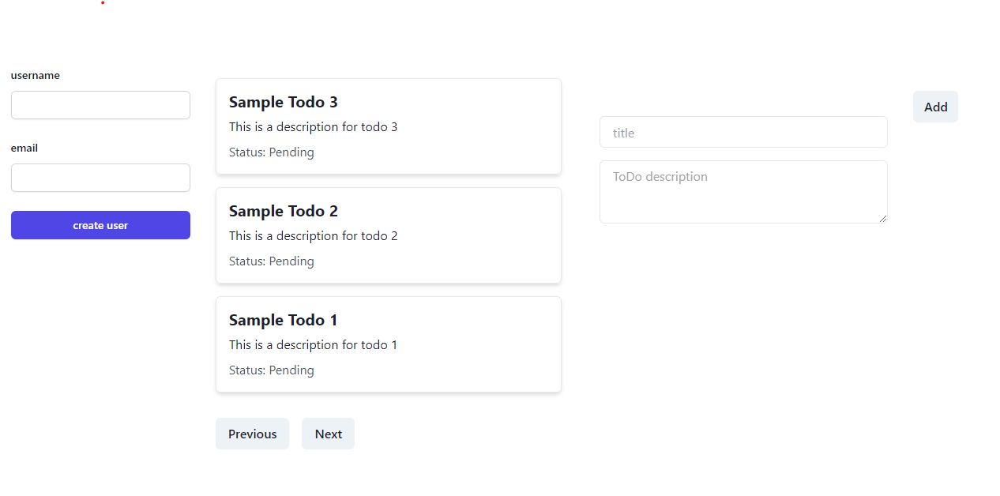
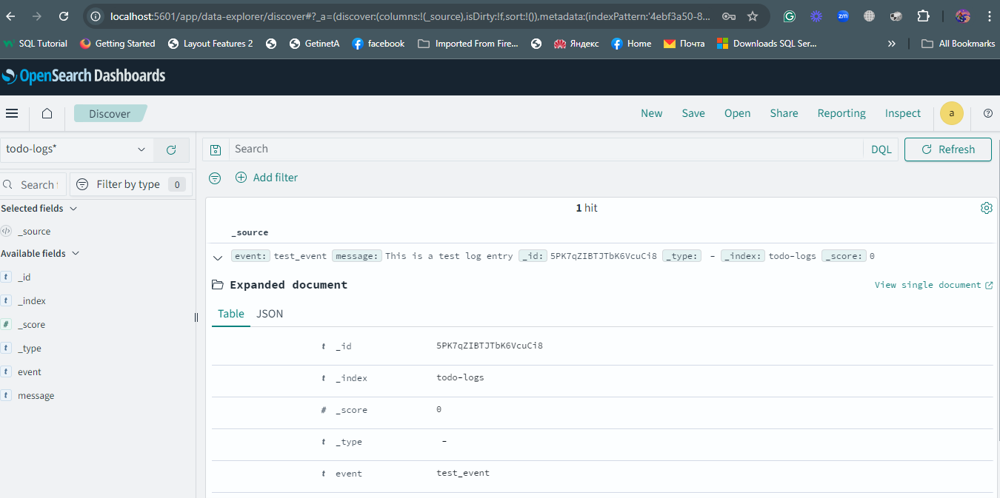
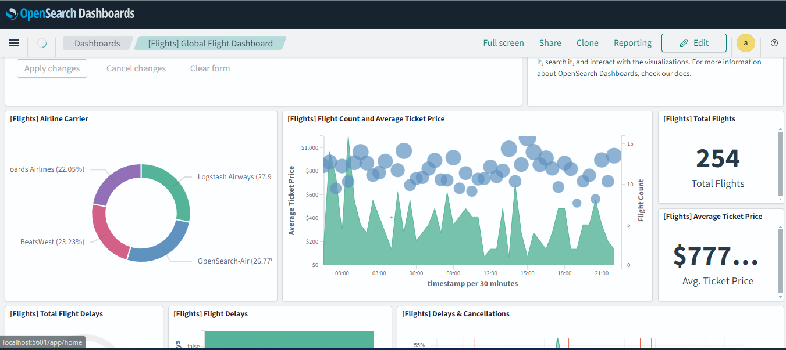

# Docker Compose Configuration and CI/CD Pipeline Overview

## Table of Contents

- [Docker Compose Configuration and CI/CD Pipeline Overview](#docker-compose-configuration-and-cicd-pipeline-overview)
  - [Table of Contents](#table-of-contents)
  - [Overview](#overview)
  - [CI/CD with Azure DevOps](#cicd-with-azure-devops)
    - [Pipeline Creation](#pipeline-creation)
    - [Pipeline Configuration](#pipeline-configuration)
  - [Overview](#overview-1)
  - [CI/CD with Azure DevOps](#cicd-with-azure-devops-1)
    - [Pipeline Creation](#pipeline-creation-1)
  - [Logging Stack Setup with Fluentd and OpenSearch](#logging-stack-setup-with-fluentd-and-opensearch)
  - [Security Best Practices](#security-best-practices)
  - [Bonus: Documentation and Ansible Integration](#bonus-documentation-and-ansible-integration)
    - [Documentation](#documentation)
    - [Ansible for Fluentd and OpenSearch Setup](#ansible-for-fluentd-and-opensearch-setup)
  - [Docker Compose Configuration](#docker-compose-configuration)
    - [Networks](#networks)
    - [Services](#services)
    - [Volumes](#volumes)
  - [Docker Image Optimization](#docker-image-optimization)
  - [Screenshots](#screenshots)
    - [Example Application Screenshot](#example-application-screenshot)
    - [CI/CD Pipeline Screenshot](#cicd-pipeline-screenshot)
    - [OpenSearch Dashboard Screenshot](#opensearch-dashboard-screenshot)
  - [Contact Information](#contact-information)

## Overview

This document provides a comprehensive overview of the Docker Compose configuration for the application, the CI/CD pipeline setup using Azure DevOps, and the implementation of a logging stack utilizing Fluentd and OpenSearch. Additionally, it outlines strategies for optimizing Docker images and ensuring adherence to security best practices.

## CI/CD with Azure DevOps

### Pipeline Creation

1. **Pipeline Configuration**: Create a pipeline in Azure DevOps to automate the deployment of the application. This pipeline will encompass stages for building, testing, and deploying the application.

2. **Docker Swarm for Orchestration**: 
   - Implement Docker Swarm to facilitate the management and orchestration of services, allowing for seamless scaling and deployment across multiple nodes.
   - Define the service stack using a `docker-compose.yml` file that incorporates all necessary services, including `todo-api`, `todo-front`, `cassandra`, `fluentd`, `opensearch`, and `opensearch-dashboard`.

3. **Optimized Docker Images**: 
   - Utilize multi-stage builds in Dockerfiles to minimize the size of the final images, improving deployment speed and reducing resource consumption.
   - Implement caching strategies and eliminate unnecessary layers to further enhance image performance.

4. **Branch Policies**: 
   - Configure branch policies to enforce quality checks prior to deployments, including mandatory pull request reviews and automated testing.
   - Establish distinct environments for testing and production to validate code thoroughly before it is merged into the main branches.

### Pipeline Configuration

The Azure DevOps pipeline is defined to build and deploy the Next.js frontend service. Below is the YAML configuration for the pipeline:

```yaml
trigger:
  branches:
    include:
      - main
      - develop

pool:
  vmImage: 'ubuntu-latest'

jobs:
- job: BuildNextJsService
  displayName: 'Build Next.js Frontend'
  steps:
  - script: |
      cd todo-front
      npm install
      npm run build
    displayName: 'Build Next.js Frontend'

  - script: |
      docker build -t your-docker-repo/todo-front:$(Build.BuildId) .
    displayName: 'Build Docker Image'

  - task: Docker@2
    inputs:
      containerRegistry: 'your-service-connection' # Define your service connection
      repository: 'your-docker-repo/todo-front'
      command: 'push'
      tags: '$(Build.BuildId)'

  - stage: Deploy
    displayName: 'Deploy to Environment'
    jobs:
    - deployment: DeployNextJsService
      displayName: 'Deploy Next.js Frontend'
      environment: 'test' # Change to your environment
      strategy:
        runOnce:
          deploy:
            steps:
            - script: echo "Deploying Next.js to test environment"
              displayName: 'Deploy Next.js'
```
## Overview

This document provides a comprehensive overview of the Docker Compose configuration for the application, the CI/CD pipeline setup using Azure DevOps, and the implementation of a logging stack utilizing Fluentd and OpenSearch. Additionally, it outlines strategies for optimizing Docker images and ensuring adherence to security best practices.

## CI/CD with Azure DevOps

### Pipeline Creation

1. **Pipeline Configuration**: Create a pipeline in Azure DevOps to automate the deployment of the application. This pipeline will encompass stages for building, testing, and deploying the application.

2. **Docker Swarm for Orchestration**: 
   - Implement Docker Swarm to facilitate the management and orchestration of services, allowing for seamless scaling and deployment across multiple nodes.
   - Define the service stack using a `docker-compose.yml` file that incorporates all necessary services, including `todo-api`, `todo-front`, `cassandra`, `fluentd`, `opensearch`, and `opensearch-dashboard`.

3. **Optimized Docker Images**: 
   - Utilize multi-stage builds in Dockerfiles to minimize the size of the final images, improving deployment speed and reducing resource consumption.
   - Implement caching strategies and eliminate unnecessary layers to further enhance image performance.

4. **Branch Policies**: 
   - Configure branch policies to enforce quality checks prior to deployments, including mandatory pull request reviews and automated testing.
   - Establish distinct environments for testing and production to validate code thoroughly before it is merged into the main branches.

## Logging Stack Setup with Fluentd and OpenSearch

1. **Fluentd Configuration**: 
   - Set up Fluentd to collect application logs and route them to OpenSearch for centralized logging and monitoring.
   - Define input and output configurations to handle various log formats effectively.

2. **OpenSearch Setup**: 
   - Deploy OpenSearch for log storage and indexing, ensuring proper configuration for high availability and optimal performance.
   - Leverage security features, such as role-based access control and SSL/TLS encryption, to safeguard log data.

## Security Best Practices

- **Image Security**: Regularly scan images for vulnerabilities and utilize official base images.
- **Environment Variables**: Store sensitive information in Azure DevOps secure variables to avoid hardcoding credentials in Dockerfiles or application code.
- **Network Security**: Utilize Docker’s network segmentation features to isolate services and restrict container communication.
- **Monitoring and Alerts**: Establish monitoring for the CI/CD pipeline and logging stack to promptly detect and address issues.

## Bonus: Documentation and Ansible Integration

### Documentation

Robust documentation is essential for application maintenance and team onboarding. Key components include:

- **Architecture Overview**: A detailed description of the application architecture and service interactions.
- **Deployment Process**: Step-by-step instructions for deploying the application via Azure DevOps.
- **Logging Configuration**: Documentation of the Fluentd and OpenSearch setup, including configuration for inputs and outputs.

### Ansible for Fluentd and OpenSearch Setup

To automate Fluentd and OpenSearch deployments, Ansible can be utilized:

1. **Playbook Creation**: Develop Ansible playbooks that define installation and configuration procedures for Fluentd and OpenSearch on target servers.
2. **Role-Based Configuration**: Organize tasks into reusable roles for better maintainability.
3. **Inventory Management**: Maintain an inventory file to specify target servers, enabling efficient scaling and management of the logging stack.

## Docker Compose Configuration

### Networks

| Network Name    | Driver  |
|------------------|---------|
| todo-network     | bridge  |

### Services

| Service Name        | Build Context      | Dockerfile Link                            | Ports          | Environment Variables                                                                                     | Dependencies                | Healthcheck Command                             |
|---------------------|--------------------|--------------------------------------------|----------------|-----------------------------------------------------------------------------------------------------------|------------------------------|-------------------------------------------------|
| todo-api            | `./todo-api`       | [Dockerfile](./todo-api/Dockerfile)      | `8081:8081`    | `CASSANDRA_HOST=cassandra`, `CASSANDRA_PORT=9042`, `FLUENTD_HOST=fluentd`                               | cassandra (healthy)         | N/A                                             |
| todo-front          | `./todo-front`     | [Dockerfile](./todo-front/Dockerfile)    | `3000:3000`    | N/A                                                                                                       | todo-api                     | N/A                                             |
| cassandra           | N/A                | [Dockerfile](./cassandra/Dockerfile)      | `9042:9042`    | `CASSANDRA_CLUSTER_NAME=TodoCluster`, `CASSANDRA_DC=DC1`, `CASSANDRA_RACK=RAC1`                       | N/A                          | `cqlsh -e "describe cluster"`                  |
| fluentd             | `./fluentd`        | [Dockerfile](./fluentd/Dockerfile)        | `24224:24224`  | N/A                                                                                                       | N/A                          | `curl -f http://localhost:24224`              |
| opensearch          | N/A                | [Dockerfile](./opensearch/Dockerfile)      | `9200:9200`    | `discovery.type=single-node`, `OPENSEARCH_INITIAL_ADMIN_PASSWORD=Gize@123!`, `plugins.security.ssl.http.enabled=false`, `plugins.security.ssl.transport.enabled=true` | N/A                          | `curl -f http://localhost:9200`               |
| opensearch-dashboard | N/A                | [Dockerfile](./opensearch-dashboard/Dockerfile) | `5601:5601`    | `OPENSEARCH_HOSTS=http://opensearch:9200`, `OPENSEARCH_USERNAME=Gize`, `OPENSEARCH_PASSWORD=Gize@123!` | N/A                          | N/A                                             |

### Volumes

| Volume Name       | Path                         |
|-------------------|------------------------------|
| cassandra_data    | `/var/lib/cassandra`         |

## Docker Image Optimization

To enhance the efficiency and performance of the Docker images used in this application, the following strategies were implemented:

1. **Multi-Stage Builds**: 
   - The Dockerfile employs multi-stage builds to separate the build environment from the production environment, reducing the final image size and including only the necessary artifacts for application execution.

2. **Base Image Selection**: 
   - Utilizing the `node:18-alpine` base image minimizes the overall size compared to standard Debian-based images.

3. **Conditional Dependency Installation**: 
   - Dependencies are installed based on the presence of specific lock files (`yarn.lock`, `package-lock.json`, or `pnpm-lock.yaml`), ensuring consistent installations and flexibility in managing dependencies.

4. **User Permissions**: 
   - The application runs as a non-root user (`nextjs`) to enhance security and prevent privilege escalation vulnerabilities.

5. **Environment Variables**: 
   - Environment variables are used to configure application settings, making the images more flexible and easier to maintain without code changes.

## Screenshots

### Example Application Screenshot



### CI/CD Pipeline Screenshot



### OpenSearch Dashboard Screenshot




## Contact Information

For questions or further information, please contact:

- **Name**: Gizework Melkamu
- **Email**: gizeworkmelkamu70@gmail.com
- **GitHub**: [Your GitHub Profile](https://github.com/gize21)
- **Role**: Softare Engineer, DevOps Engineer
